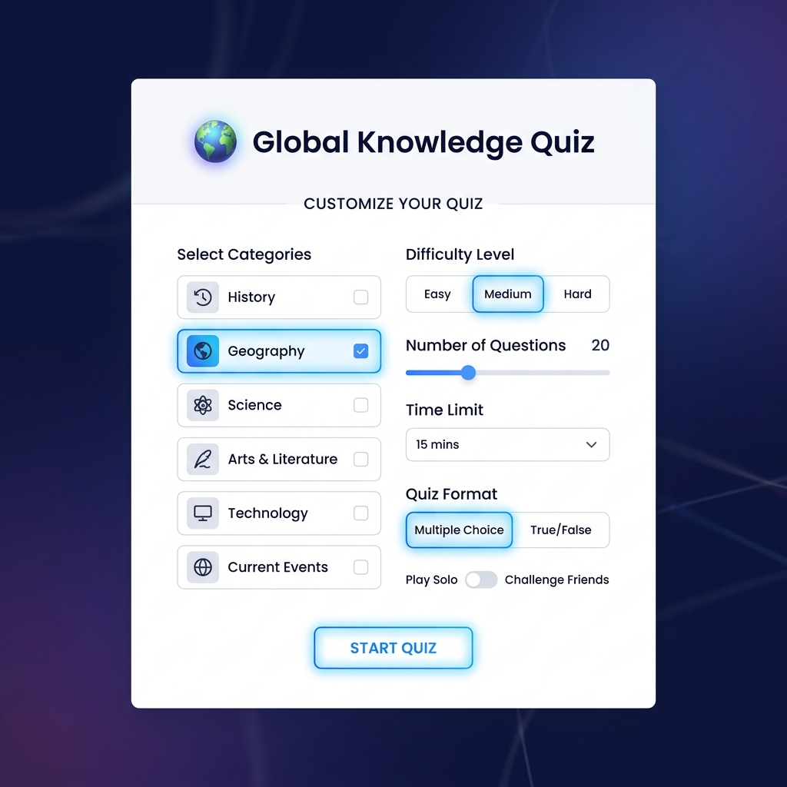

# 🌍 Global Knowledge Quiz App

A modern, highly customizable trivia quiz application built with vanilla HTML, CSS, and JavaScript. The app is powered by the **Open Trivia Database (OpenTDB) API** to fetch dynamic, up-to-date questions across various categories and difficulty levels.



---

## 🚀 Live Demo

<!-- DEPLOYMENT_LINK_START -->
[](https://vercel.com)
<!-- DEPLOYMENT_LINK_END -->

*(This URL is updated automatically upon successful deployment)*

---

## ✨ Features

- ⚙️ **Fully Customizable Quizzes:** Select from 24 quiz categories, multiple difficulty levels (Easy, Medium, Hard, Any), and configure question counts (10, 15, 20).
- ⏱️ **Countdown Timer:** Keeps track of your time as you progress through questions.
- 🎨 **Modern Dark UI:** Premium styling featuring glassmorphic components, micro-animations, and clean progress indicators.
- 📊 **Detailed Scoring & Analysis:** Interactive results dashboard with a dynamic percentage ring, correct answers count, time taken, and a detailed breakdown of correct vs incorrect answers with explanations.
- 📱 **Responsive Layout:** Designed to look beautiful on desktops, tablets, and mobile devices.

---

## 🛠️ Technology Stack

- **Frontend:** HTML5 (Semantic Structure)
- **Styling:** Vanilla CSS3 (Custom Properties, Flexbox/Grid, Animations)
- **Logic:** Vanilla JavaScript (ES6+, Fetch API for asynchronous requests)
- **API:** Open Trivia Database (OpenTDB)
- **Icons:** FontAwesome 6

---

## 📂 File Structure

```
├── index.html       # Application interface & layout
├── styles.css       # Custom stylesheets and animations
├── script.js        # Core logic, state management, and API calls
└── README.md        # Project documentation
```

---

## ⚙️ How to Run Locally

Since this is a client-side static web application, it does not require a compilation step.

1. **Clone the repository:**
   ```bash
   git clone https://github.com/Shubham2643/Quiz-App.git
   cd Quiz-App
   ```

2. **Open the project:**
   Simply double-click `index.html` to open it in your web browser, or use a local development server like **Live Server** in VS Code.

---

## 🤖 Automated README Updates

This repository uses a GitHub Action workflow to automatically keep the live demo link updated in this README. Whenever a new deployment succeeds on Vercel, the action extracts the deployment URL and updates the badge link above.
